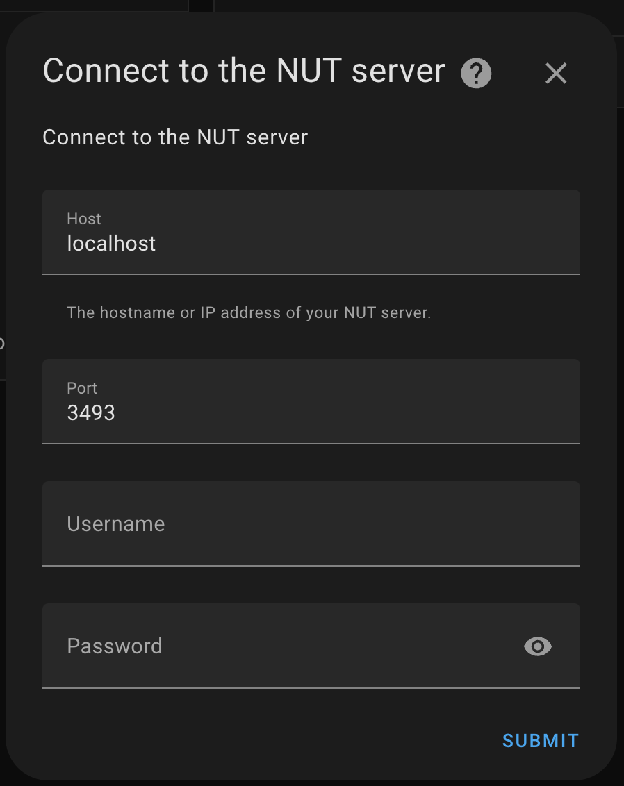

# nobreak-nut

`nobreak-nut` is a Docker-based solution for managing and monitoring uninterruptible power supplies (UPS) using Network UPS Tools (NUT). There are also instructions and a dashboard example to be used in Home Assistant to display the UPS data.


## Table of Contents

- [Getting Started](#getting-started)
- [Prerequisites](#prerequisites)
- [Installation](#installation)
- [Configuration](#configuration)
- [Usage](#usage)
- [Contributing](#contributing)
- [License](#license)

## Getting Started

These instructions will help you set up and run the `nobreak-nut` container on your local machine.

### Prerequisites

Ensure you have the following installed on your system:

- [Docker](https://docs.docker.com/get-docker/)
- [Docker Compose](https://docs.docker.com/compose/install/)

### Installation

1. Clone the repository:
    ```sh
    git clone https://github.com/brunohenriquy/nobreak-nut.git
    cd nobreak-nut
    ```

2. Build and run the Docker container:
    ```sh
    docker-compose up --build -d
    ```

### Configuration

`nobreak-nut` uses several configuration files located in the `etc/nut` directory. These files include:

- `nut.conf`
- `ups.conf`
- `upsd.conf`
- `upsd.users`
- `upsmon.conf`

Make sure these files are configured according to your UPS and network setup.

**NOTE: Today it's configured for the TS Shara 1800VA (Model: 4539)**

### Usage
To interact with the running nobreak-nut container, use the NUT tools or the Home Assistant integration.

### Home Assistant Configuration
- Install the integration https://www.home-assistant.io/integrations/nut
- Click on Configure
- Enter the data:

   

#### The Dashboard example can be found [here](home_assistant/dashboard.yaml)


### Contributing
Feel free to contribute by opening issues, suggesting features, or submitting pull requests.

### License
This project is licensed under the MIT License.

